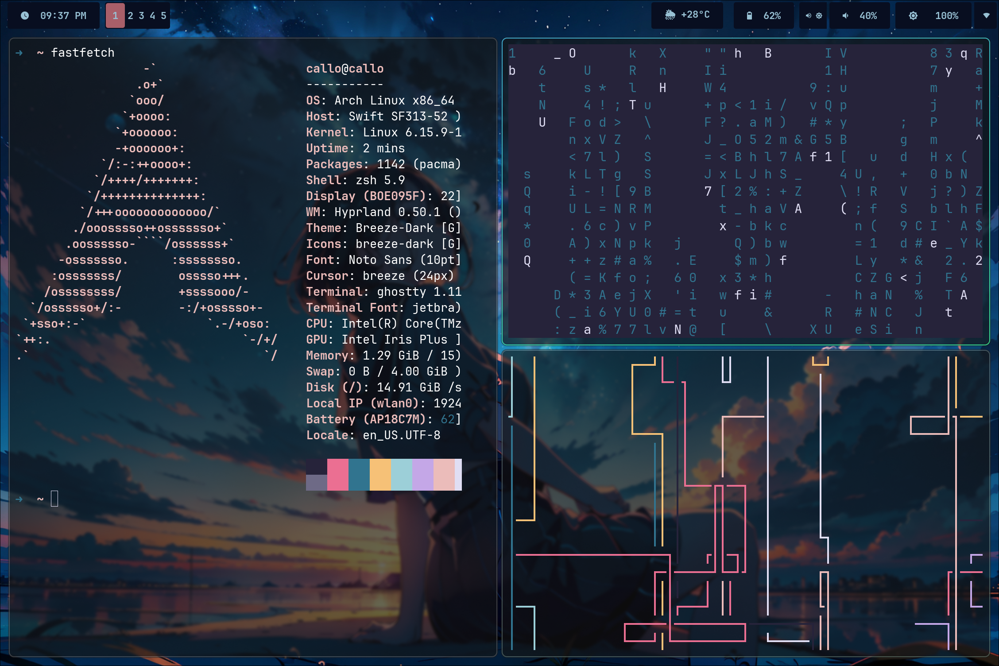

## My Dotfiles - Hyprland Anime-Inspired Rice

> A beautiful, minimal, and expressive Hyprland setup themed around a serene anime night sky

This repository contains my personal configuration files (dotfiles) for various applications and tools I use. These configurations help me maintain a consistent and efficient working environment across different machines, with a focus on an **anime-style aesthetic** featuring deep blues, rich purples, and gentle pinks painting the horizon.

> Just something I did for fun with an old laptop a family member had — they got a new one, so I gave this machine a new life. It's running Arch Linux, by the way.

## Screenshot

### Desktop Overview


## Theme Overview

This setup embraces an **anime-style aesthetic** with a character gazing at a **stunning starry night sky**. It's designed for **beauty and clarity**, ideal for those who want a peaceful yet functional workspace.

* **Color Palette**: Deep blue, purple, subtle pink
* **Compositor**: [Hyprland](https://github.com/hyprwm/Hyprland)
* **Status Bar**: Waybar with anime-themed styling
* **Terminal**: Ghostty with custom configuration
* **Shell**: Zsh with productivity aliases and eza file listing
* **Editor**: Neovim with complete LSP setup, markdown preview, web development tools, and database management
* **Terminal Multiplexer**: Tmux with anime-themed styling

## What's Included

- **Hyprland**: Wayland compositor with custom keybinds and animations
- **Waybar**: Status bar with anime-themed styling  
- **Wofi**: Application launcher matching the theme
- **Ghostty**: Modern terminal emulator configuration
- **Tmux**: Terminal multiplexer with custom styling
- **Neovim**: Complete editor setup with LSP, plugins, markdown preview, full web dev stack, and database management
- **Zsh**: Shell configuration with productivity aliases and modern file listing

## Quick Start

1. **Clone the repository:**
   ```bash
   git clone https://github.com/Floranaras/dotfiles.git ~/.dotfiles
   cd ~/.dotfiles
   ```

2. **Install prerequisites** - See [INSTALLATION.md](docs/INSTALLATION.md) for detailed OS-specific instructions

3. **Use stow to create symbolic links:**
   ```bash
   stow hypr waybar wofi ghostty tmux nvim zsh
   ```

4. **First-time setup:**
   ```bash
   # Reload configurations
   hyprctl reload
   source ~/.zshrc
   
   # Open Neovim to auto-install plugins
   nvim
   ```

## Key Features

### **Beautiful Anime Aesthetic**
Deep blues, purples, and gentle pinks create a serene workspace inspired by starry night skies.

### **Modern Shell Experience** 
Zsh with eza file listing, tree views, and productivity aliases. See [SHELL.md](docs/SHELL.md) for all aliases.

### **Powerful Neovim Setup**
Complete LSP configuration for multiple languages (C/C++, Lua, Java, HTML/CSS/JS), live web development server, Emmet support, database management with vim-dadbod, and markdown preview. Full details in [NEOVIM.md](docs/NEOVIM.md), [WEBDEV.md](docs/WEBDEV.md), and [NEOVIM_DB.md](docs/NEOVIM_DB.md).

### **Hyprland Integration**
Dynamic tiling with smooth animations and custom keybinds optimized for productivity.

### **Cross-Platform**
Configurations work across Linux, macOS, and Windows (WSL), with automatic dependency handling.

## Documentation

- **[INSTALLATION.md](docs/INSTALLATION.md)** - Complete installation guide for all operating systems
- **[CONFIGURATION.md](docs/CONFIGURATION.md)** - Detailed configuration explanations
- **[SHELL.md](docs/SHELL.md)** - Shell aliases, functions, and productivity features
- **[NEOVIM.md](docs/NEOVIM.md)** - Neovim setup, keybindings, and features
- **[WEBDEV.md](docs/WEBDEV.md)** - Web development setup with Emmet, live server, and LSP
- **[NEOVIM_DB.md](docs/NEOVIM_DB.md)** - Database management with vim-dadbod and DBUI
- **[TROUBLESHOOTING.md](docs/TROUBLESHOOTING.md)** - Solutions for common issues

## Configuration Structure

```bash
.
├── ghostty/      # Ghostty terminal configuration
├── hypr/         # Hyprland configuration files  
├── images/       # Screenshot
├── nvim/         # Complete Neovim setup with plugins
├── tmux/         # Tmux configuration with anime theme
├── waybar/       # Waybar config and styling
├── wofi/         # Wofi config and custom styling
└── zsh/          # Zsh configuration with aliases
```

## Quick Reference

**Essential aliases:**
- `l` - Tree view with icons (2 levels)
- `ll` - Detailed file listing with icons  
- `grun` - Run Gradle project quickly
- `ginit <name>` - Initialize Java project

**Neovim shortcuts:**
- `<space>pf` - Find files
- `<space>ps` - Live grep search
- `<space>md` - Markdown preview
- `<space>ls` - Start live server (web dev)
- `<space>db` - Database UI
- `Ctrl+y,` - Trigger Emmet expansion
- `gd` - Go to definition

See individual documentation files for complete references.

## Final Thoughts

This rice is meant to offer a calm, elegant workspace — inspired by anime visuals and cosmic beauty. Whether you're coding, building web apps with live reload, managing databases, handling multiple terminal sessions, writing markdown documentation, or vibing with lofi, this desktop is your new starry refuge.

> "Even the darkest nights will end, and the stars will shine again." ✨

### Contact / Credit
Crafted with love by **Callo**

## Contributing

If you have suggestions for improvements or find any issues, feel free to open an issue or submit a pull request.

## License

This repository is available under the MIT License. Feel free to use and modify these configurations for your own setup.
