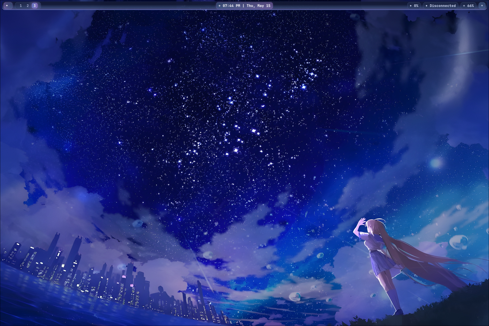
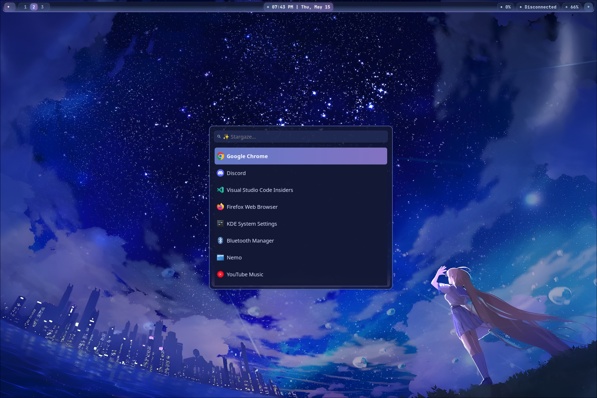
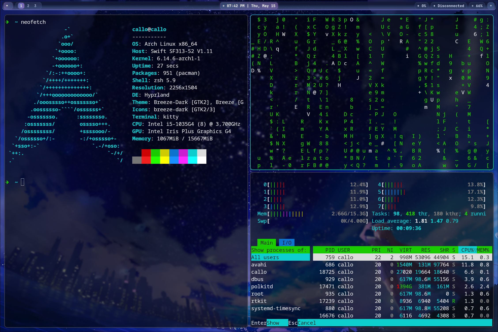

# My Dotfiles - Hyprland Anime-Inspired Rice

> A beautiful, minimal, and expressive Hyprland setup themed around a serene anime night sky

This repository contains my personal configuration files (dotfiles) for various applications and tools I use. These configurations help me maintain a consistent and efficient working environment across different machines, with a focus on an **anime-style aesthetic** featuring deep blues, rich purples, and gentle pinks painting the horizon.

> Just something I did for fun with an old laptop a family member had — they got a new one, so I gave this machine a new life. It's running Arch Linux, by the way.

## Theme Overview

This setup embraces an **anime-style aesthetic** with a character gazing at a **stunning starry night sky**. It's designed for **beauty and clarity**, ideal for those who want a peaceful yet functional workspace.

* **Color Palette**: Deep blue, purple, subtle pink
* **Compositor**: [Hyprland](https://github.com/hyprwm/Hyprland)
* **Launcher**: Wofi with custom styling
* **Status Bar**: Waybar, clean and themed
* **Terminal**: Ghostty with custom configuration
* **Editor**: Neovim with complete plugin setup
* **Shell**: Zsh with custom configuration
* **Wallpaper**: Managed by Hyprpaper

---

## Screenshots

### Desktop Overview


---

### Wofi Launcher


---

### Waybar + Window Management


---

## What's Included

- **Hyprland**: Wayland compositor configuration with custom keybinds, window rules, and animations
- **Waybar**: Status bar configuration with anime-themed styling
- **Wofi**: Application launcher with custom styling to match the theme
- **Ghostty**: Modern terminal emulator configuration
- **Neovim**: Complete editor setup with LSP, plugins, and custom keymaps
- **Zsh**: Shell configuration and customizations

## Prerequisites

Before you begin, ensure you have the following installed on your system:

- **stow**: A symbolic link farm manager used to manage dotfiles. You can install it via your distribution's package manager:
  - Arch Linux: `sudo pacman -S stow`
  - Debian/Ubuntu: `sudo apt-get install stow`
  - Fedora: `sudo dnf install stow`
  - macOS: `brew install stow`

- **The applications themselves**: Make sure you have the relevant applications installed:
  - **Hyprland**: Dynamic tiling Wayland compositor
  - **hyprpaper**: Wallpaper utility for Hyprland
  - **Waybar**: Highly customizable Wayland bar
  - **Wofi**: Application launcher for wlroots-based compositors
  - **Ghostty**: Fast, feature-rich terminal emulator
  - **Neovim**: Hyperextensible Vim-based text editor
  - **Zsh**: Extended Bourne shell with improvements
  - **Nerd Font** (e.g. `FiraCode Nerd Font`)

## Installation

To set up these dotfiles, follow these steps:

1. **Clone the repository:**
   ```bash
   git clone https://github.com/Floranaras/dotfiles.git ~/.dotfiles
   ```

2. **Navigate to the dotfiles directory:**
   ```bash
   cd ~/.dotfiles
   ```

3. **Use stow to create symbolic links:**
   For each application or configuration directory in this repository, use `stow` to create the necessary symbolic links in your home directory.

   **For Hyprland configuration:**
   ```bash
   stow hypr
   ```
   This will link the Hyprland configuration files to `~/.config/hypr/`

   **For Waybar configuration:**
   ```bash
   stow waybar
   ```
   This will link the Waybar configuration to `~/.config/waybar/`

   **For Wofi configuration:**
   ```bash
   stow wofi
   ```
   This will link the Wofi configuration to `~/.config/wofi/`

   **For Neovim configuration:**
   ```bash
   stow nvim
   ```
   This will link the Neovim configuration to `~/.config/nvim/`

   **For Ghostty terminal:**
   ```bash
   stow ghostty
   ```
   This will link the Ghostty config to `~/.config/ghostty/`

   **For Zsh configuration:**
   ```bash
   stow zsh
   ```
   This will link the `.zshrc` file to your home directory

   **To install all configurations at once:**
   ```bash
   stow */
   ```

## Configuration Structure

```bash
.
├── ghostty
│   └── .config/ghostty/       # Ghostty terminal configuration
├── hypr
│   └── .config/hypr/
│       ├── environment.conf   # Environment variables
│       ├── hyprland.conf      # Main Hyprland config
│       ├── hyprpaper.conf     # Wallpaper configuration
│       └── wofi_launcher.sh   # Custom script for launching Wofi
├── images
│   ├── screenshot1.png        # Desktop overview
│   ├── screenshot2.png        # Wofi launcher
│   └── screenshot3.png        # Waybar and windows
├── nvim
│   └── .config/nvim/          # Complete Neovim setup with plugins
├── waybar
│   └── .config/waybar/
│       ├── config             # Waybar main config
│       └── style.css          # Anime-themed Waybar styling
├── wofi
│   └── .config/wofi/
│       ├── config             # Wofi config
│       └── style.css          # Custom Wofi style matching theme
└── zsh
    └── .zshrc                 # Zsh configuration
```

## Usage

Once the symbolic links are created using `stow`, the respective applications will automatically pick up these configurations when you launch them.

### First Time Setup
After stowing the configurations:

1. **Restart your Hyprland session** or reload the configuration:
   ```bash
   hyprctl reload
   ```

2. **For Neovim**, the plugins will be automatically installed on first launch thanks to the plugin manager

3. **Restart Waybar** if it's already running:
   ```bash
   killall waybar && waybar &
   ```

### Launch Notes

You can launch the custom Wofi with:
```bash
bash ~/.config/hypr/wofi_launcher.sh
```

Make sure to set executable permissions if needed:
```bash
chmod +x ~/.config/hypr/wofi_launcher.sh
```

## Configuration Highlights

### Neovim
- Complete plugin setup for development
- LSP configuration for code intelligence
- Custom keymaps and options
- Theme matching the overall aesthetic

### Ghostty
- Modern terminal emulator configuration
- Custom styling and performance optimizations

### Zsh
- Enhanced shell experience with custom configurations
- Improved productivity and aesthetics

## Troubleshooting

If you encounter issues:

1. **Check if stow created the links correctly:**
   ```bash
   ls -la ~/.config/hypr/
   ls -la ~/.config/nvim/
   ls -la ~/.config/waybar/
   ```

2. **For Hyprland issues**, check the logs:
   ```bash
   journalctl -f --user-unit hyprland
   ```

3. **For Neovim plugin issues**, run health checks:
   ```
   :checkhealth
   ```

## Final Thoughts

This rice is meant to offer a calm, elegant workspace — inspired by anime visuals and cosmic beauty. Whether you're coding or vibing with lofi, this desktop is your new starry refuge.

> "Even the darkest nights will end, and the stars will shine again." ✨

---

## Contributing

If you have suggestions for improvements or find any issues, feel free to open an issue or submit a pull request.

---

## Hyprland Rice Showcase

This dotfiles repository also features a **Hyprland Anime-Inspired Rice** — a beautiful, minimal, and expressive setup themed around a serene anime night sky with deep blues, rich purples, and gentle pinks painting the horizon.

### Theme Overview

* **Color Palette**: Deep blue, purple, subtle pink
* **Compositor**: [Hyprland](https://github.com/hyprwm/Hyprland)
* **Launcher**: Wofi with custom styling
* **Status Bar**: Waybar, clean and themed
* **Wallpaper**: Managed by Hyprpaper

### Hyprland Configuration Features

- Custom window rules and workspace management
- Optimized animations matching the anime aesthetic
- Integrated with Waybar and Wofi
- Custom wallpaper management with hyprpaper
- Anime-themed color scheme throughout

### Waybar
- Anime-themed styling with deep blues and purples
- Custom modules for system monitoring
- Clean, minimal design

### Wofi
- Custom styling matching the starry night theme
- Optimized for quick application launching

### Launch Notes

You can launch the custom Wofi with:
```bash
bash ~/.config/hypr/wofi_launcher.sh
```

Make sure to set executable permissions if needed:
```bash
chmod +x ~/.config/hypr/wofi_launcher.sh
```

### Final Thoughts

This rice is meant to offer a calm, elegant workspace — inspired by anime visuals and cosmic beauty. Whether you're coding or vibing with lofi, this desktop is your new starry refuge.

> "Even the darkest nights will end, and the stars will shine again." ✨

### Contact / Credit
Crafted with love by **Callo**

**Wallpaper by**: まころん / makoron
[@makoron117117 on X (Twitter)](https://x.com/makoron117117)

## License

This repository is available under the MIT License. Feel free to use and modify these configurations for your own setup.
