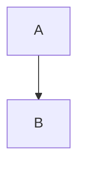

# Troubleshooting

## General

### Plugins not installing

```vim
:Lazy sync
:Lazy clean
:Lazy restore
```

If still failing:
```bash
rm -rf ~/.local/share/nvim/lazy
nvim  # Will reinstall everything
```

### Neovim crashes on startup

```bash
# Start with minimal config
nvim --noplugin

# Check health
:checkhealth
```

Common causes:
- Incompatible plugin versions
- Missing dependencies (ripgrep, fd, bat)
- Corrupted plugin cache

## Telescope

### No preview showing

**Check dependencies:**
```bash
which bat    # Should show path
which rg     # Should show path
```

If missing:
```bash
# macOS
brew install bat ripgrep

# Linux
sudo apt install bat ripgrep  # Debian/Ubuntu
sudo dnf install bat ripgrep  # Fedora
sudo pacman -S bat ripgrep    # Arch
```

**Run diagnostics:**
```vim
:checkhealth telescope
```

**Check terminal size:**
- Preview requires ~80+ columns
- Try fullscreen terminal

### Error: `ft_to_lang` not found

You're on Neovim 0.11.x (nightly). Solutions:

1. **Downgrade to stable:**
```bash
brew uninstall neovim
brew install neovim  # Installs 0.10.x
```

2. **Or accept the warning** - preview still works

### Telescope is slow

```vim
:Lazy update telescope-fzf-native.nvim
```

Then rebuild:
```bash
cd ~/.local/share/nvim/lazy/telescope-fzf-native.nvim
make
```

## LSP

### LSP not starting

**Check if server installed:**
```vim
:Mason
```

Install required servers:
- clangd (C/C++)
- lua-language-server (Lua)
- jdtls (Java)

**Check LSP status:**
```vim
:LspInfo
```

**Restart LSP:**
```vim
:LspRestart
```
or use `<leader>zig`

### Java LSP not working

**Check Java installed:**
```bash
java -version  # Should show 11+
```

**Start manually:**
```vim
:JdtStart
```

**Check workspace:**
- Per-project workspaces stored in `~/.local/share/nvim/site/java/workspace-root/`
- Delete corrupted workspace: `rm -rf ~/.local/share/nvim/site/java/workspace-root/<project>`

**Check JDTLS path:**
```lua
-- Edit ftplugin/java.lua
-- Verify jdtls_bin path matches your installation
```

### Clangd errors

**Generate compile_commands.json:**

CMake:
```bash
cmake -DCMAKE_EXPORT_COMPILE_COMMANDS=1 .
```

Make:
```bash
bear -- make
```

Compile commands must be in project root or parent directory.

## Markdown Preview

### Peek not working

**Check deno installed:**
```bash
deno --version
```

If not:
```bash
brew install deno  # macOS
curl -fsSL https://deno.land/install.sh | sh  # Linux
```

**Rebuild manually:**
```bash
cd ~/.local/share/nvim/lazy/peek.nvim
deno task build
```

Or in Neovim:
```vim
:PeekRebuild
```

**Check build success:**
```bash
ls ~/.local/share/nvim/lazy/peek.nvim/app/build/main.js
```

If file exists, restart Neovim.

### Mermaid diagrams not rendering

Ensure using niko-holmes fork:
```lua
-- In plugins/markdown.lua
"niko-holmes/peek.nvim"  -- Not "toppair/peek.nvim"
```

Verify syntax:
````markdown

````

## Database (Dadbod)

### Connection fails

**Check database running:**
```bash
# MySQL
sudo systemctl status mysql

# PostgreSQL
sudo systemctl status postgresql
```

**Test connection manually:**
```bash
mysql -u root -p
psql -U postgres
```

**Add connection string:**
```vim
:DBUI
# Then press 'A' to add connection
```

### Queries not saving

Queries auto-save to `~/sql_queries/`. Check:
```bash
ls ~/sql_queries/
```

Manual save in SQL buffer: `<leader>ss`

## Live Server

### Server not starting

**Check npm package:**
```bash
npm list -g live-server
```

If not installed:
```bash
npm install -g live-server
```

**Port already in use:**
Change port in `plugins/liveserver.lua`:
```lua
args = { "--port=8081" }  -- Change from 8080
```

## Treesitter

### Syntax highlighting broken

**Update parsers:**
```vim
:TSUpdate
```

**Install specific language:**
```vim
:TSInstall javascript
```

**Check installed:**
```vim
:TSInstallInfo
```

### Parser compilation fails

Install build tools:

macOS:
```bash
xcode-select --install
```

Linux:
```bash
sudo apt install build-essential  # Debian/Ubuntu
sudo dnf groupinstall "Development Tools"  # Fedora
sudo pacman -S base-devel  # Arch
```

## Color Scheme

### Transparent background not working

Some terminals don't support transparency. Try:

1. Enable in terminal emulator settings
2. Test with another theme:
```vim
:ColorScheme tokyonight
```

### Colors look wrong

**Check terminal support:**
```vim
:set termguicolors?
```

Should show `termguicolors`. If not:
```vim
:set termguicolors
```

Add to terminal config:
```bash
export TERM=xterm-256color
```

## Performance

### Slow startup

**Profile startup:**
```bash
nvim --startuptime startup.log
cat startup.log
```

**Lazy-load plugins:**
Most plugins already lazy-load on filetype or command.

**Disable unused plugins:**
Comment out in `lua/plugins/` directory.

## Clipboard

### System clipboard not working

**Linux:**
```bash
sudo apt install xclip  # X11
sudo apt install wl-clipboard  # Wayland
```

**Check setting:**
```vim
:set clipboard?
```

Should show `clipboard=unnamedplus`.

## Recovery

### Nuclear option - fresh install

```bash
# Backup
mv ~/.config/nvim ~/.config/nvim.backup
mv ~/.local/share/nvim ~/.local/share/nvim.backup
mv ~/.cache/nvim ~/.cache/nvim.backup

# Reinstall
cd ~/.dotfiles
stow nvim
nvim  # Fresh plugin install
```

### Restore from backup

```bash
rm -rf ~/.config/nvim
mv ~/.config/nvim.backup ~/.config/nvim
```

## Getting Help

1. Run `:checkhealth` for general diagnostics
2. Run `:checkhealth [plugin]` for specific plugin
3. Check plugin documentation: `:help [plugin]`
4. Enable debug logging:
```vim
:lua vim.lsp.set_log_level("debug")
```
Check logs: `~/.local/state/nvim/lsp.log`
