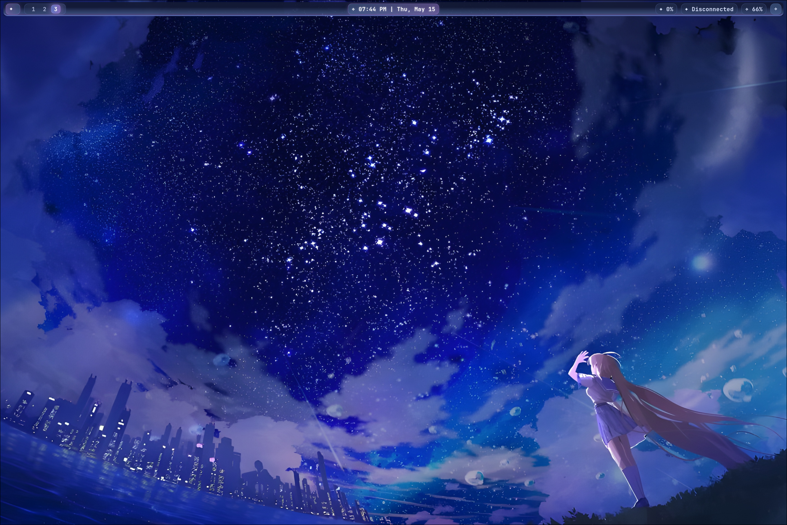
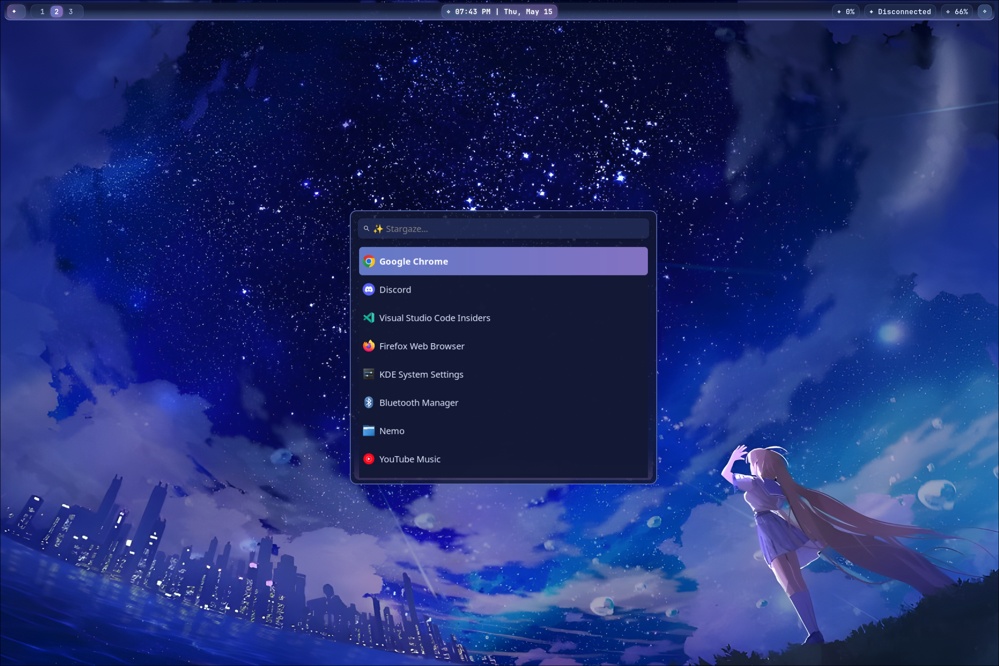
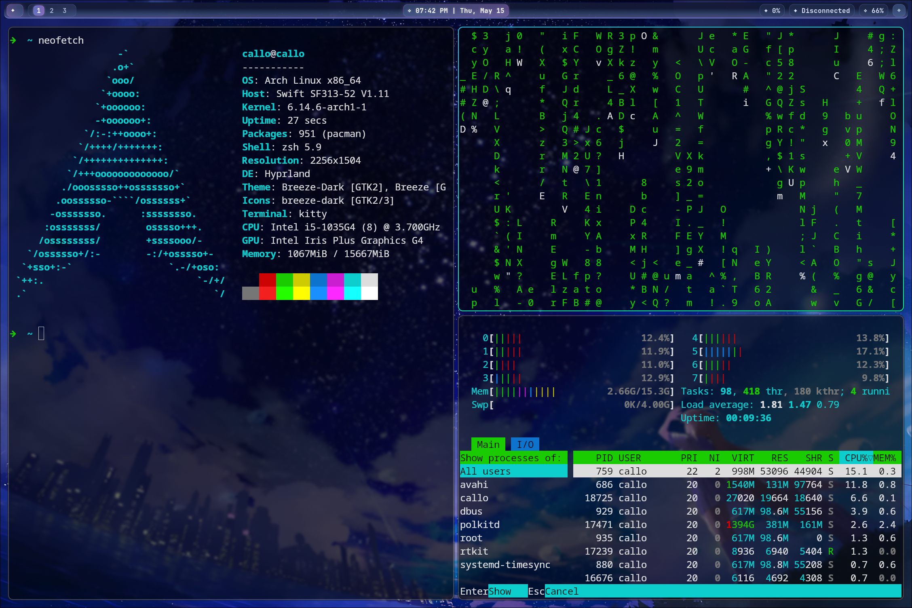

# Hyprland Anime-Inspired Rice

> A beautiful, minimal, and expressive Hyprland setup themed around a serene anime night sky

## Theme Overview

This setup embraces an **anime-style aesthetic** with a character gazing at a **stunning starry night sky** — deep blues, rich purples, and gentle pinks painting the horizon. It's designed for **beauty and clarity**, ideal for those who want a peaceful yet functional workspace.

> Just something I did for fun with an old laptop a family member had — they got a new one, so I gave this machine a new life. It's running Arch Linux, by the way.

* **Color Palette**: Deep blue, purple, subtle pink
* **Compositor**: [Hyprland](https://github.com/hyprwm/Hyprland)
* **Launcher**: Wofi with custom styling
* **Status Bar**: Waybar, clean and themed
* **Wallpaper**: Managed by Hyprpaper

---

## Screenshots

### Desktop Overview



---

### Wofi Launcher



---

### Waybar + Window Management



---

## Configuration Structure

```bash
.
├── hypr
│   ├── environment.conf       # Environment variables
│   ├── hyprland.conf          # Main Hyprland config
│   ├── hyprpaper.conf         # Wallpaper configuration
│   └── wofi_launcher.sh       # Custom script for launching Wofi
├── images
│   ├── screenshot1.png        # Desktop overview
│   ├── screenshot2.png        # Wofi launcher
│   └── screenshot3.png        # Waybar and windows
├── waybar
│   ├── config                 # Waybar main config
│   ├── config.txt             # Backup or notes
│   ├── style.css              # Main Waybar styling
│   └── style.txt              # Backup or notes
└── wofi
    ├── config                 # Wofi config
    └── style.css              # Custom Wofi style
```

---

## Requirements

* [Hyprland](https://github.com/hyprwm/Hyprland)
* `hyprpaper` for wallpaper management
* `waybar` for status bar
* `wofi` for app launcher
* Nerd Font (e.g. `FiraCode Nerd Font`)
* Anime wallpaper (see `hyprpaper.conf`)

---

## Launch Notes

You can launch the custom Wofi with:

```bash
bash hypr/wofi_launcher.sh
```

Make sure to set executable permissions if needed:

```bash
chmod +x hypr/wofi_launcher.sh
```

---

## Final Thoughts

This rice is meant to offer a calm, elegant workspace — inspired by anime visuals and cosmic beauty. Whether you're coding or vibing with lofi, this desktop is your new starry refuge.

> “Even the darkest nights will end, and the stars will shine again.” ✨

---

### Contact / Credit

Crafted with love by **Callo**
**Wallpaper by**: まころん / makoron
[@makoron117117 on X (Twitter)](https://x.com/makoron117117)

---

